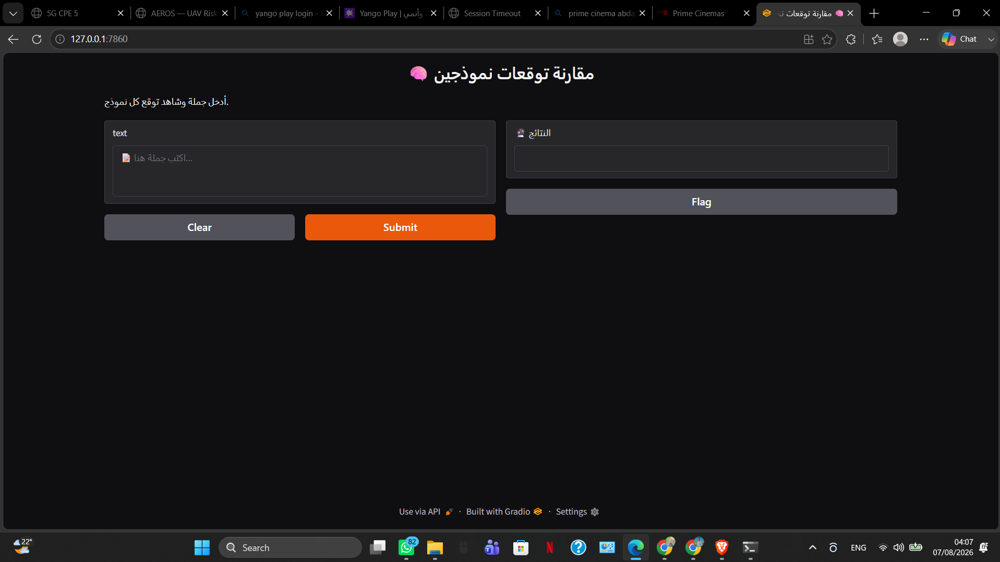
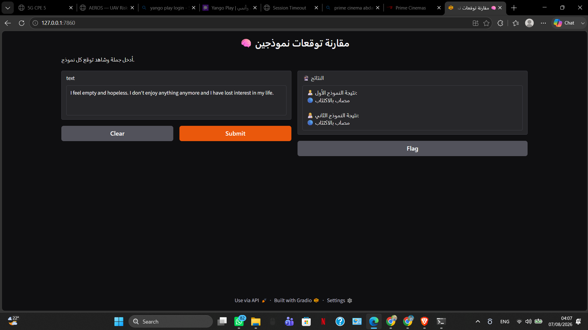
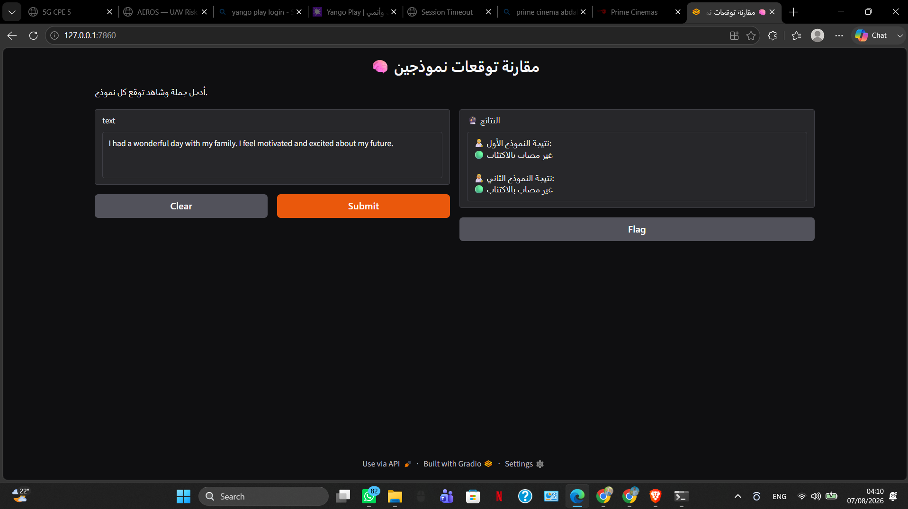

# 🧠 Reddit Depression Detection using Transformer Models

Transformer-based Natural Language Processing (NLP) system for early depression detection from Reddit posts using **MiniLM** and **ELECTRA** with an interactive **Gradio** interface.

---

## 📖 Overview

Mental health issues have become increasingly prevalent on social media platforms. This project leverages state-of-the-art transformer language models to automatically identify depressive patterns in Reddit posts.

The system compares two fine-tuned transformer architectures and allows users to evaluate predictions through an interactive Gradio web application.

---

## ✨ Features

- Depression detection from Reddit posts
- Fine-tuned MiniLM transformer
- Fine-tuned ELECTRA transformer
- Side-by-side model comparison
- Interactive Gradio interface
- Real-time inference
- Easy deployment and testing

---

## 📂 Project Structure

```text
reddit-depression-detection-transformers/
│
├── Models/
│   ├── nreimers MiniLM Model/
│   └── saved_model_electra/
│
├── Mini LM Model.ipynb
├── electra-small-discriminator.ipynb
├── GUI.ipynb
├── Gradio.py
├── requirements.txt
└── README.md
```

---

## 🤖 Models Used

| Model | Purpose |
|--------|---------|
| MiniLM | Depression Classification |
| ELECTRA | Depression Classification |

---

## 📊 Dataset

The models were trained and evaluated on a balanced Reddit depression dataset containing posts labeled as:

- 🔴 Depressed
- 🟢 Non-Depressed

The text was preprocessed and tokenized using Hugging Face tokenizers before fine-tuning.

---

## ⚙️ Installation

```bash
git clone https://github.com/AmmarAlrousan/reddit-depression-detection-transformers.git

cd reddit-depression-detection-transformers

pip install -r requirements.txt
```

---

## ▶️ Run

Launch the Gradio interface:

```bash
python Gradio.py
```

After launching, open:

```
http://127.0.0.1:7860
```

---

## 📈 Model Comparison

The application loads both transformer models simultaneously and compares their predictions on the same Reddit post.

### MiniLM

- Lightweight architecture
- Faster inference
- Lower computational cost

### ELECTRA

- Strong contextual understanding
- Robust transformer encoder
- Competitive depression classification performance

The Gradio interface enables real-time comparison between both models.

---

## 🛠 Technologies

- Python
- PyTorch
- Hugging Face Transformers
- MiniLM
- ELECTRA
- Gradio
- Pandas
- NumPy
- Scikit-learn

---

## 📸 Demo

### Home Interface



---

### Prediction Example



---

### Model Comparison



---

## 🚀 Future Improvements

- Support multilingual depression detection
- Explainable AI (XAI) visualization
- Confidence score visualization
- Mental health multi-class classification
- Cloud deployment
- REST API integration
- Larger benchmark datasets

---

## 📄 License

This project is released under the MIT License.

---

## 👤 Author

**Ammar Atef Alrousan**

AI Engineer | NLP | Computer Vision | LLMs

GitHub:
https://github.com/AmmarAlrousan

LinkedIn:
https://www.linkedin.com/in/ammar-alrousan-681b252b6
